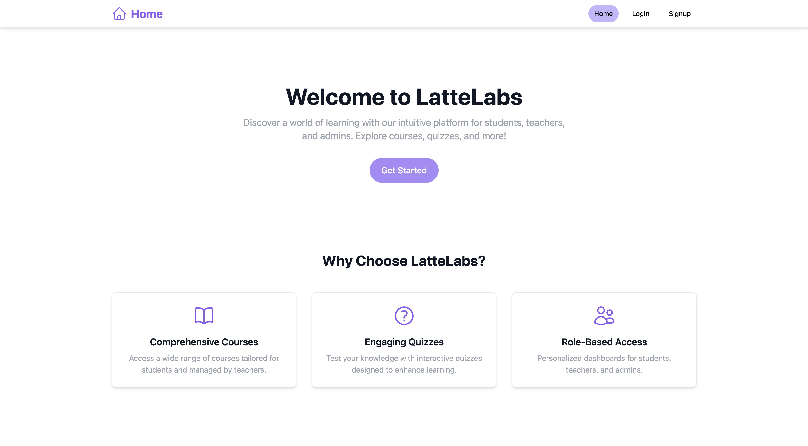
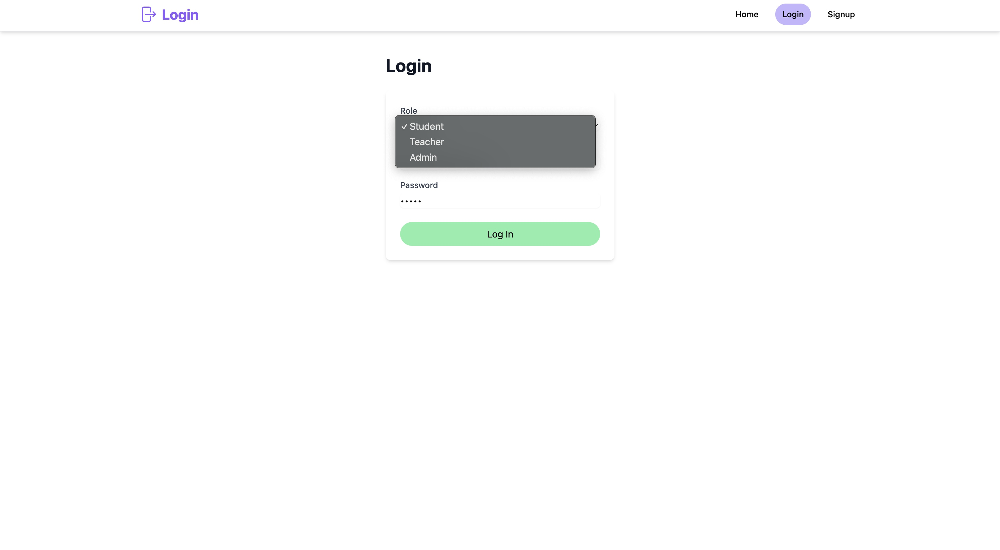
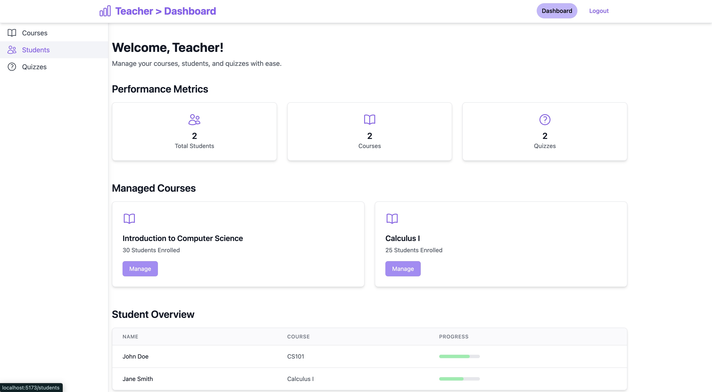
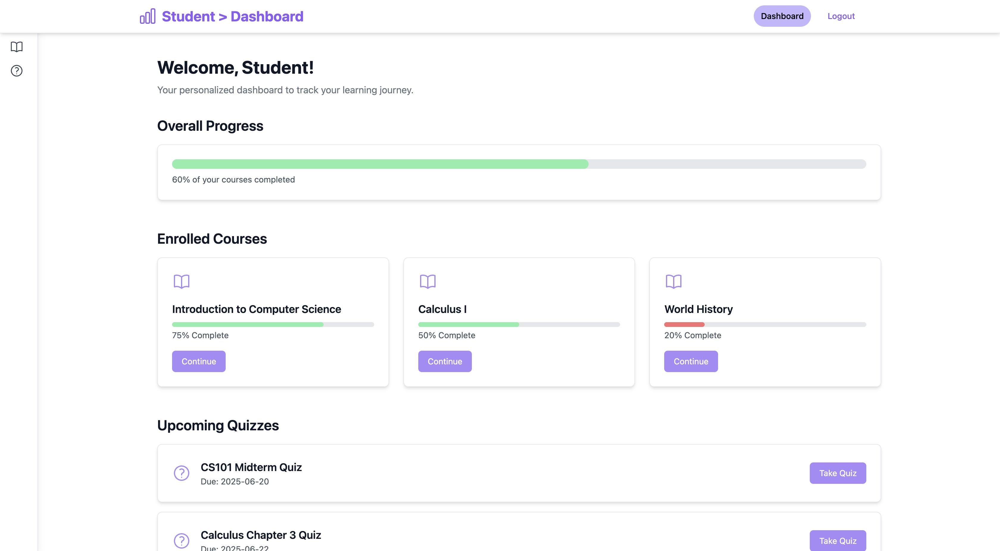

# LMS Project (Frontend)

**LatteLabs** is a desktop Learning Management System (LMS) built with **React**, **Vite**, and **Tailwind CSS**. It features role-based dashboards for Admin, Teacher, and Student users with functionality like user management, course enrollment, and protected routing.

---

## 📸 Screenshots

### 🏠 Home Page


### 🔐 Login Page


### 🧑‍🏫 Teacher Dashboard


### 🎓 Student Dashboard



---

## ✨ Features

- **Role-Based Dashboards**:
  - **Admin**: Manage users and courses (`/dashboard`, `/users`, `/courses`)
  - **Teacher**: Manage courses and students (`/dashboard`, `/courses`, `/students`)
  - **Student**: View enrolled courses and quizzes (`/dashboard`, `/enrolled-courses`, `/quizzes`)
- **Authentication**: Login (`/login`) and Signup (`/signup`) with role selection
- **Protected Routes**: Role-based access control using React Router
- **UI**: 
  - Fixed top navbar (`bg-blue-600`)
  - Hover-expandable sidebar (64px → 256px)
  - Main content area (`max-w-7xl`)
- **Enrolled Courses**: Students can view enrolled courses (mock data to be replaced with backend integration)
- **Icons**: Uses Heroicons for modern UI aesthetics

---

## 🛠 Tech Stack

- **React**: `^18.2.0`
- **Vite**: `^5.4.8`
- **React Router**: `^6.26.2`
- **Tailwind CSS**: `^3.4.14`
- **Heroicons**: `^2.1.5`
- **Axios**: For HTTP requests to backend (not yet connected)

---

## ⚙️ Prerequisites

Ensure you have the following installed:

- **Node.js**: `>= 18`
- **npm**: `>= 8`

---

## 🚀 Setup Instructions

1. **Clone the Repository**:
   ```bash
   git clone https://github.com/vermamanav005/lms-project.git
   cd lms-project
